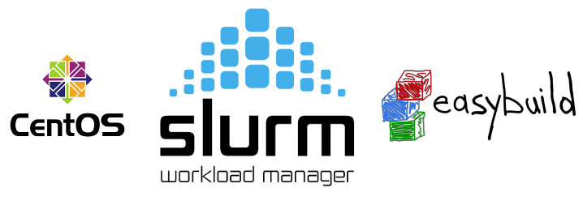

# Documentation of CIIRC Cluster.

Welcome to the CIIRC cluster documentation pages.

These pages contains all the documentation formerly hosted on CIIRC
Dokuwiki and presented in information mails. This documentation is
made with hope that it will be clearer and easier to navigate.

We all benefit from well written and up to date documentation. Therefore, 
contributions to improving the docs are more than welcome. 

Drop a line to it@ciirc.cvut.cz and become a member of the documentation team.
We are grateful for your support.

## Cluster access

!!! Note
    Everyone with CIIRC account can access master node of the cluster via
    **ssh at cluster.ciirc.cvut.cz**. To gain permissions to Slurm job planning
    service, please send a request ticket through
    [CIIRC HelpDesk](https://helpdesk.ciirc.cvut.cz/).
    

On master node you can look around, explore available sw modules, try
your code etc... If you want perform heavy computing via Slurm (see
below) you have to apply for additional permission. Please ask via
helpdesk or mail to it@ciirc.cvut.cz

It is not recommended to run heavy computations on the login / head / master node.
Please use interactive jobs for that.

